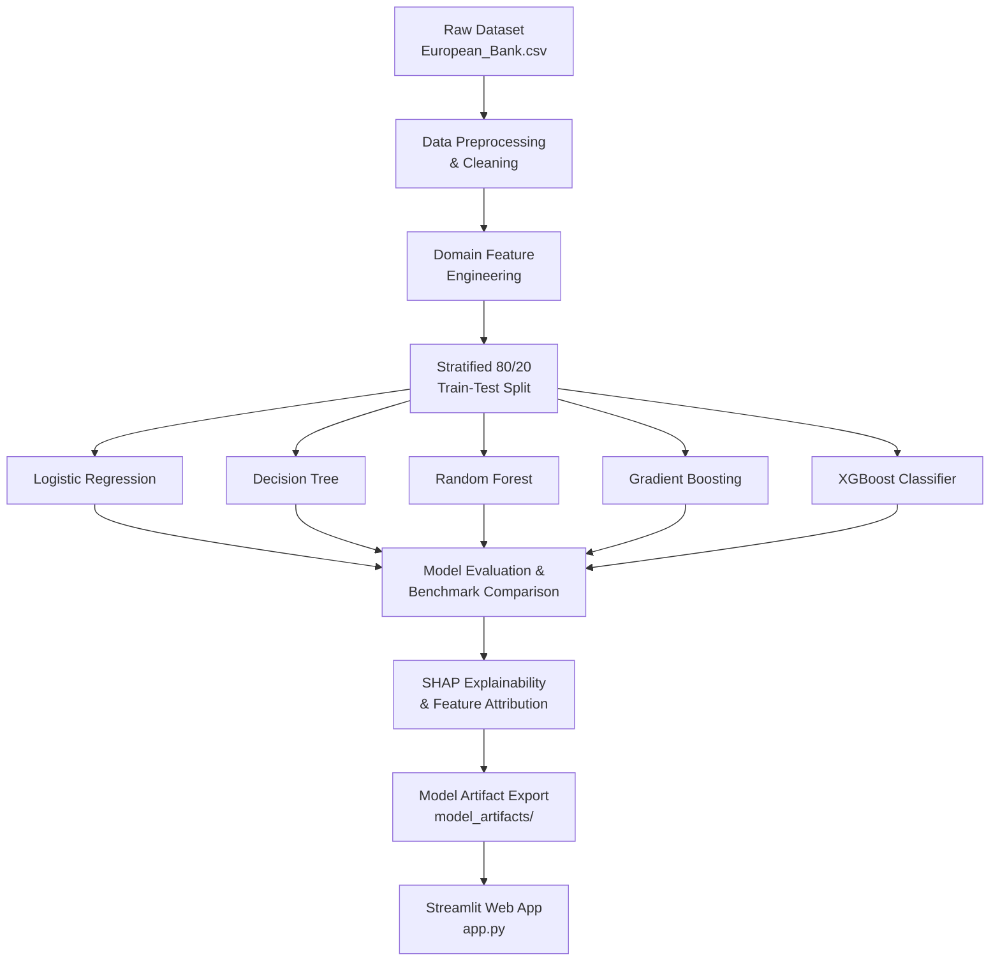

<div align="center">

# Bank Customer Churn Intelligence Platform
### *Predictive Modeling, Risk Scoring & Explainable AI for Retail Banking*

[](https://bank-customer-churn-prediction-n5qoq7vmewtvyez2wczmmx.streamlit.app/)
[](https://www.python.org/)
[](https://streamlit.io/)
[](https://scikit-learn.org/)
[](https://xgboost.readthedocs.io/)
[](https://shap.readthedocs.io/)
[](LICENSE)
[](CONTRIBUTING.md)

*An end-to-end Machine Learning ecosystem assigning real-time churn probability scores to retail bank customers, uncovering key flight drivers via SHAP, and offering an interactive Streamlit analytics suite.*

**[Try the Live App →](https://bank-customer-churn-prediction-n5qoq7vmewtvyez2wczmmx.streamlit.app/)**

[Features](#key-features) • [Quick Start](#quick-start-guide) • [Model Benchmarks](#model-performance-benchmarks) • [Streamlit App](#streamlit-web-application) • [Architecture](#project-architecture) • [Research Paper](research_paper.md)

</div>

---

## Table of Contents
- [About The Project](#about-the-project)
- [Key Features](#key-features)
- [Project Architecture](#project-architecture)
- [Model Performance Benchmarks](#model-performance-benchmarks)
- [Feature Engineering Matrix](#feature-engineering-matrix)
- [Streamlit Web Application](#streamlit-web-application)
- [Quick Start Guide](#quick-start-guide)
- [Real-World Banking Insights](#real-world-banking-insights)
- [Regulatory Compliance & Ethics](#regulatory-compliance--ethics)
- [Contributing](#contributing)
- [License](#license)

---

## About The Project

In retail banking, acquiring a new customer costs **5 to 7 times more** than retaining an existing account holder. Traditional churn analysis is **retrospective**—analyzing exit surveys after the relationship is severed.

This project introduces a **proactive predictive churn engine** deployed on 10,000 European bank customer accounts (`European_Bank.csv`). By deploying machine learning models coupled with **SHAP (SHapley Additive exPlanations)**, bank relationship managers can identify at-risk customers early, calculate quantitative risk scores (0–100%), and simulate retention offers in real time.

---

## Key Features

- **Automated Preprocessing**: Handles missing values, strips non-informative identifiers, and encodes categorical attributes (`Geography`, `Gender`).
- **7 Domain-Derived Features**: Features built specifically for banking behavior (e.g., Balance-to-Salary Ratio, Product Density, Active Member Interaction).
- **Multi-Model Benchmarking**: Trains and compares 5 algorithms: **Logistic Regression**, **Decision Trees**, **Random Forests**, **Gradient Boosting**, and **XGBoost**.
- **Explainable AI (SHAP)**: Provides audit-compliant mathematical explanations for every prediction, adhering to European Central Bank (ECB) AI governance guidelines.
- **Interactive Streamlit Suite**: 4 modules including a **Live Churn Risk Calculator** and a **What-If Scenario Simulator**.

---

## Project Architecture



---

## Model Performance Benchmarks

Evaluated on a Stratified 80/20 Train-Test split (8,000 train / 2,000 test):

| Model Architecture | Accuracy | Precision | Recall | F1-Score | ROC-AUC | Optimal Strategy |
| :--- | :---: | :---: | :---: | :---: | :---: | :--- |
| **Logistic Regression** (Baseline) | 71.00% | 38.81% | 73.71% | 0.5085 | 0.7869 | Interpretability Benchmark |
| **Decision Tree** | 75.90% | 44.68% | **77.40%** | 0.5665 | 0.8272 | Max Recall for catching at-risk accounts |
| **Random Forest** | 84.20% | 60.61% | 63.88% | **0.6220** | 0.8568 | Balanced Precision / Recall trade-off |
| **XGBoost Classifier** | 80.15% | 50.84% | 74.45% | 0.6042 | 0.8606 | High-Recall boosting ensemble |
| **Gradient Boosting** (Selected) | **86.40%** | **75.86%** | 48.65% | 0.5928 | **0.8632** | **Top Discrimination & Campaign Precision** |

---

## Feature Engineering Matrix

| Feature Name | Formula / Logic | Business Context |
| :--- | :--- | :--- |
| `Balance_Salary_Ratio` | Balance ÷ (EstimatedSalary + 1) | Financial exposure & uninvested liquidity ratio |
| `Product_Density` | NumOfProducts ÷ (Tenure + 1) | Product adoption velocity over time |
| `Engagement_Product_Interaction` | IsActiveMember × NumOfProducts | Active power users vs passive multi-product holders |
| `Tenure_Age_Ratio` | Tenure ÷ (Age + 1) | Lifetime loyalty relative to age |
| `Credit_Age_Ratio` | CreditScore ÷ (Age + 1) | Creditworthiness normalized by life stage |
| `Is_Zero_Balance` | 1 if Balance = 0, else 0 | Flag for zero-balance shell accounts |
| `High_Risk_Age_Group` | 1 if Age is between 38 and 60, else 0 | Isolates peak historical flight risk demographic |

---

## Streamlit Web Application

The interactive web dashboard ([`app.py`](app.py)) is organized into 4 core modules:

```text
Navigation Modules
 ├── Batch Risk Scoring & CSV Export     # Upload CSV, score all customers, download results
 ├── Individual Risk Evaluation          # Real-time single customer risk scoring
 ├── Scenario Simulator                  # Test retention offers & calculate risk reduction delta
 └── Financial ROI Calculator            # Estimate campaign cost vs retention revenue
```

---

## Quick Start Guide

### 1. Clone Repository & Navigate
```bash
git clone https://github.com/Krishnapriya-prasannan/bank-customer-churn-prediction.git
cd bank-customer-churn-prediction
```

### 2. Install Dependencies
```bash
python -m pip install -r requirements.txt
```
*(or install directly: `python -m pip install pandas numpy scikit-learn xgboost shap streamlit plotly seaborn matplotlib joblib`)*

### 3. Train Models
```bash
python train_model.py
```

### 4. Launch Streamlit App
```bash
streamlit run app.py
```
Open **`http://localhost:8501`** in your browser.

---

## Real-World Banking Insights

- **The Product Paradox**: Customers holding **2 bank products** exhibit the lowest churn rate (**7.6%**). Single-product holders churn at **27.7%**, while holding **3+ products** drives churn above **82.7%** due to product friction and fee dissatisfaction.
- **The Active Member Shield**: Active digital/branch membership cuts churn propensity in half (**14.3%** active vs **26.9%** inactive).
- **Geographic Risk Variance**: German accounts exhibit a **27.5% churn rate**, significantly higher than France (**16.15%**) and Spain (**16.67%**).

---

## Regulatory Compliance & Ethics

This platform incorporates **SHAP Feature Attribution** to comply with:
- **European Central Bank (ECB) AI Governance**: Ensures AI risk scoring is audit-compliant and non-discriminatory.
- **GDPR Article 22 ("Right to Explanation")**: Guarantees customers and auditors transparency into the exact decision drivers behind automated risk scores.

---

## Contributing

Contributions are welcome! Follow these steps:
1. Fork the Project (`git checkout -b feature/AmazingFeature`)
2. Commit your Changes (`git commit -m 'Add AmazingFeature'`)
3. Push to the Branch (`git push origin feature/AmazingFeature`)
4. Open a Pull Request

---

## License

Distributed under the **MIT License**. See `LICENSE` for more information.

<div align="center">

**[Back to Top](#bank-customer-churn-intelligence-platform)**

</div>
